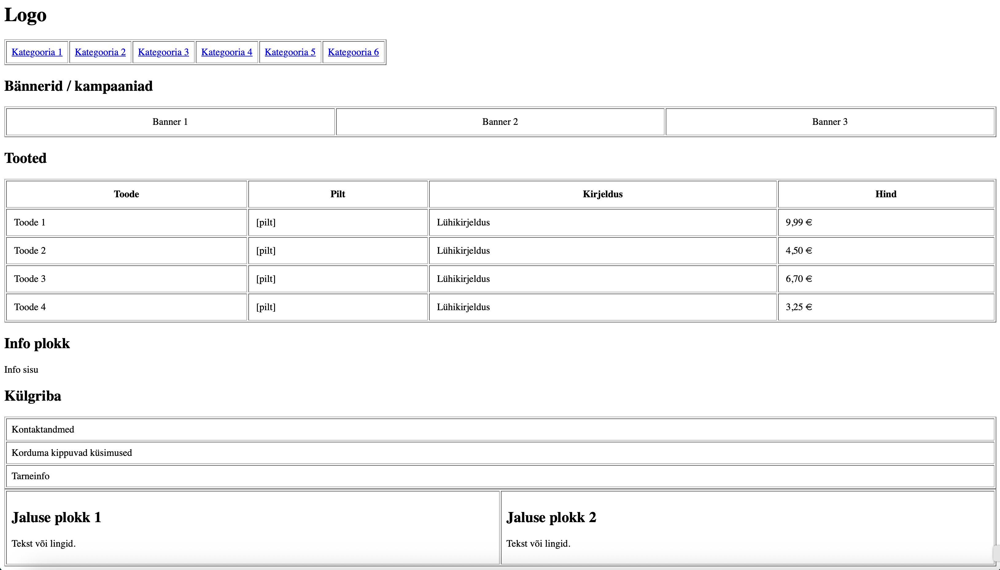

# HTML5 struktuuri skeem

Valitud sait selle projekti jaoks on: https://sumena.ee/

Leht koosneb klassikalisest ülesehitusest: ülemine päis koos logoga ja põhimenüü navigeerimisega, sellele järgneb suur hero- või kampaaniaplokk. Põhiosas on toodete või teenuste plokid tabeli kujul, millele lisandub informatiivne sisublokk ja külgriba. Lehe lõpus on jalus kahe infoplokiga, kus on lingid ja kontaktinfo.

# Ekraanipilt skeemist

